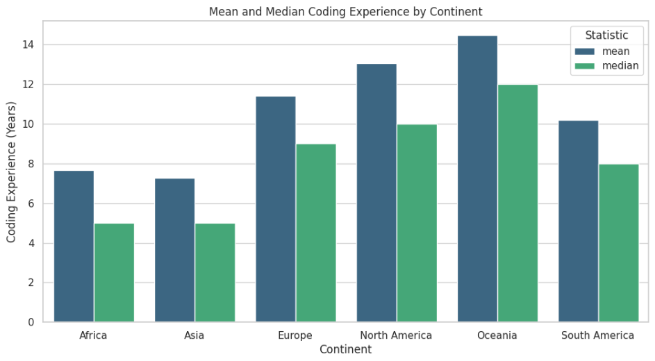
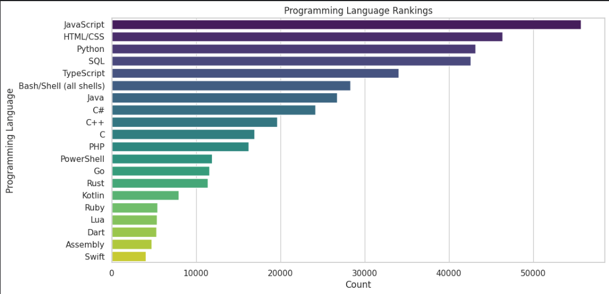

# Analizing Stack Overflow 2023 Developer Survey
[Stack Overflow 2023 Developer Survey Dataset](https://www.kaggle.com/datasets/stackoverflow/stack-overflow-2023-developers-survey)  
## Packages: Pandas, Matplotlib, Seaborn, and Geopandas.  
In this Jupyter notebook, I answered and visualized the following questions about the survey:  
1. What is the percentage of Python users in each country? 
2. What is the average coding of experience in each continent? 
3. what are the most popular programming languages? 
